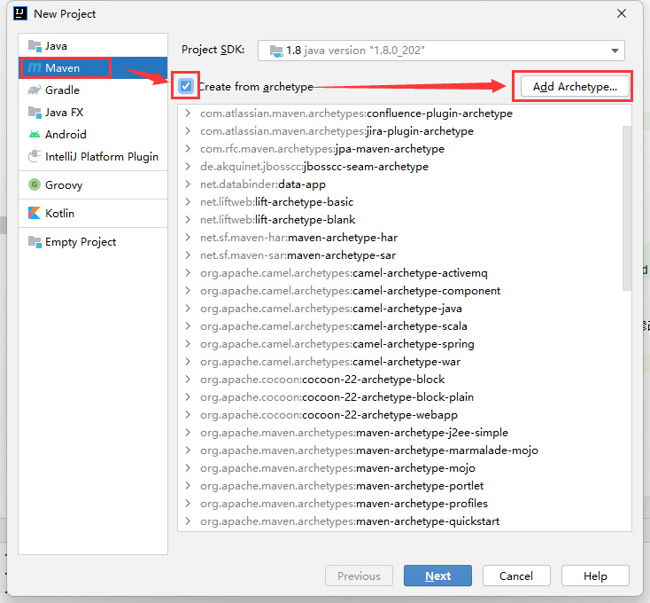
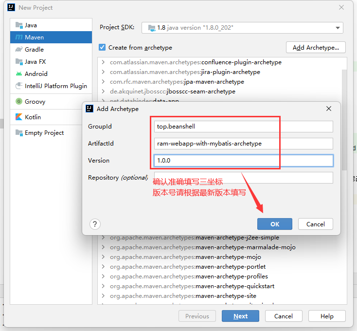
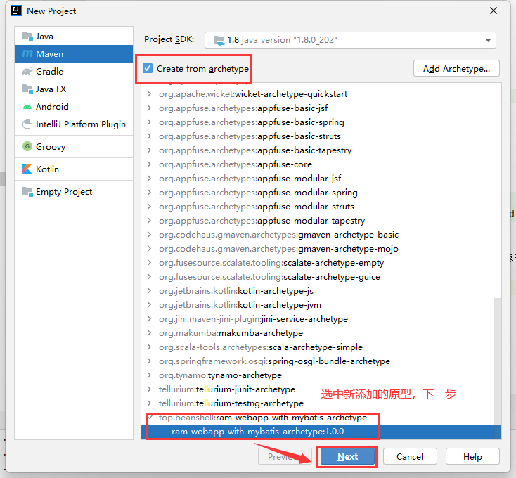
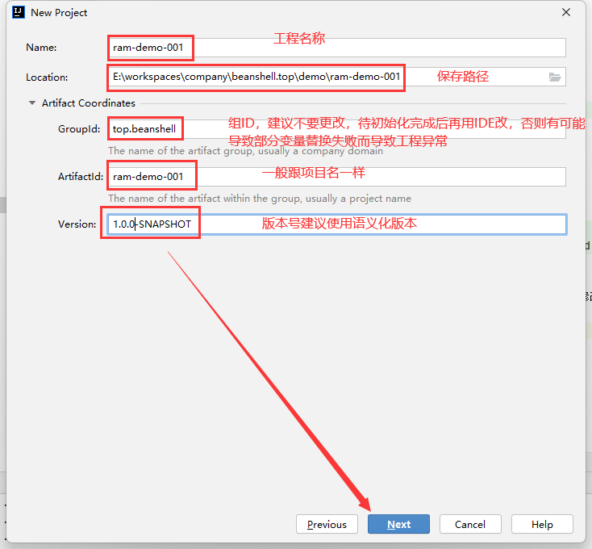
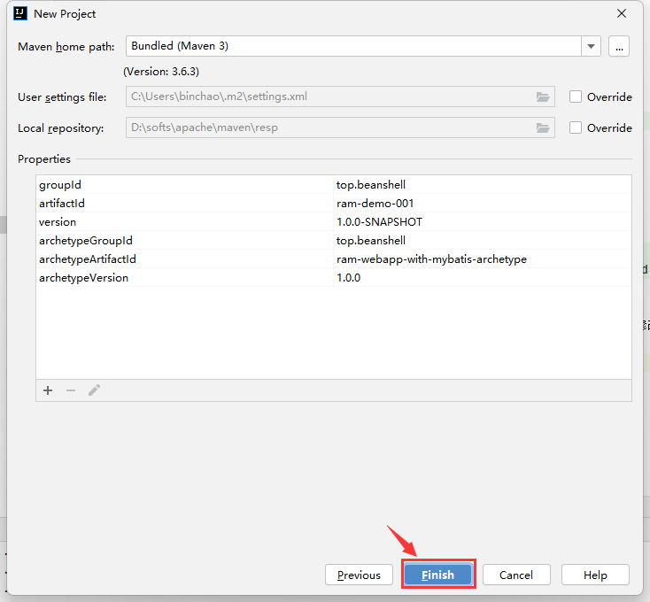
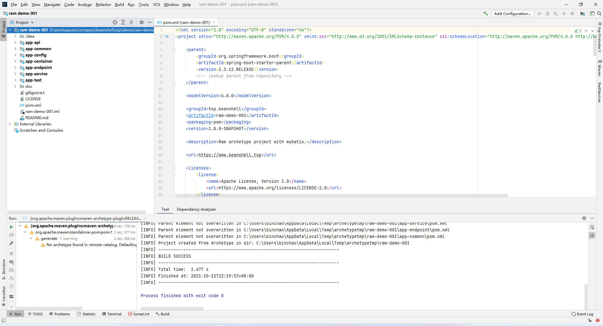
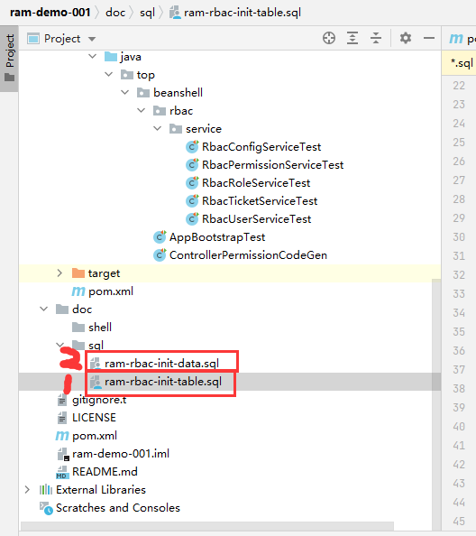
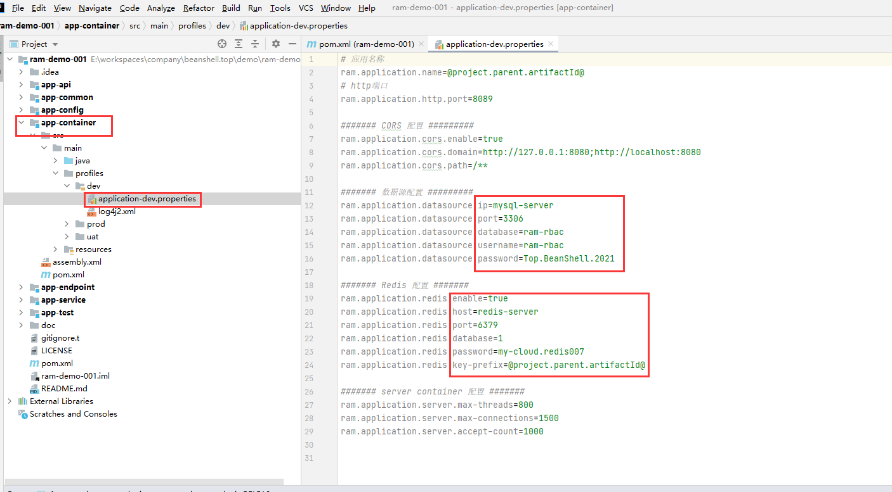
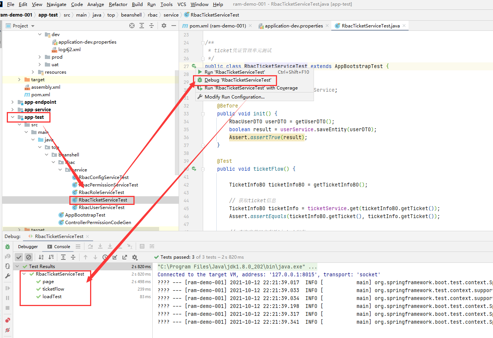
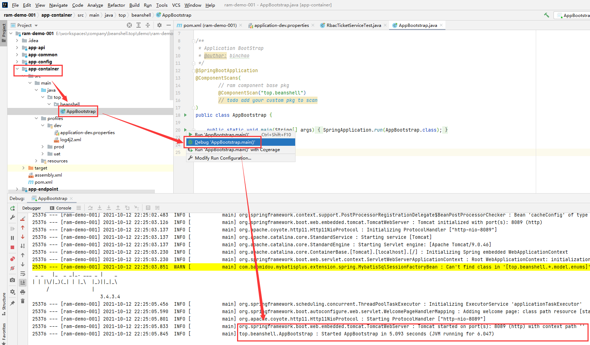

# ram-webapp-with-mybatis
ram 项目工程原型-mybatis版本

## 使用方法


### 命令行创建

命令行创建(需先安装并配置好maven)：

打开cmd(windows)/terminal(*unix)，切换到代码存放目录，执行如下命令，即可初始化项目：

注意：该命令会在当前目录自动创建一个和DartifactId名称一样的文件夹。

```bash

mvn archetype:generate -DgroupId=top.beanshell -DartifactId=your-artifact-id -Dversion=1.0.0-SNAPSHOT -Dpackage=top.beanshell -DarchetypeGroupId=top.beanshell -DarchetypeArtifactId=ram-webapp-with-mybatis-archetype -DarchetypeVersion=1.0.0-SNAPSHOT
```

将以上代码中的DartifactId替换为你想要的值，如需替换DgroupId的值，请在生成项目工程之后再修改（在此处修改会导致部分值替换异常）。

### Intellij Idea 创建

首次创建，需要先添加工程原型信息，之后才可以直接使用原型新建项目

#### 添加项目原型

New Project-->Maven-->Create from archetype--> Add Archetype



准确填写3坐标信息：

| 项目 | 值 |
|  ----  | ----  |
| GroupId | top.beanshell |
| Artifact | ram-webapp-with-mybatis-archetype |
| Version | 点击查询最新版本 |



点击OK，即可完成原型项目的添加。


#### 使用原型创建项目

在原型列表中，选择上一步添加的原型，点击Next：



按提示填写项目名称、保存路径、三坐标信息：

注意： GroupId 建议先用 top.beanshell 代替，如果命名为其他包名，会导致部分变量无法正确替换，需要后期修正才能正常运行。



点击 Finish 完成项目创建：



看到下图所示，表明项目已经初始化好了：




#### 修改系统配置信息

打开 doc/sql 文件夹，使用初始化脚本，初始化数据库（需要先创建好数据库，再执行初始化脚本）：



接着 打开 app-container/src/main/profiles/dev/application-dev.properties,按图所示，修改数据库、Redis连接信息：

注意： 原型工程默认开放 8089 HTTP端口，如有端口冲突，请也一并将application-dev.properties配置文件中的ram.application.http.port值修改为系统空闲的端口（建议端口取10000~60000中的一个）。



然后就可以使用 app-test/src/main/java/top/beanshell/rbac/service/ 目录下的单元测试代码，执行一次单元测试。
如果都能正常跑过单元测试，表明项目已经初始化好，可以开始业务代码的编写了：



单元测试都通过后，就可以使用 app-container/src/main/java/top/beanshell/AppBootstrap.java 的main方法，运行程序了：



### 修改根包名自定义包名

待完善

### 整合前端

此后台工程可适配不同版本的前端，具体整合教程，前端原型工程有介绍。

前端犹如衣服，想穿哪一件就穿哪一件：

| 前端类型 | 项目地址 |
|  ----  | ----  |
| Ant-vue | [https://github.com/mbc3320/ram-webapp-console-antv.git](https://github.com/mbc3320/ram-webapp-console-antv.git) |
| Element-UI | 待开发 |
| Ant | 待开发 |
