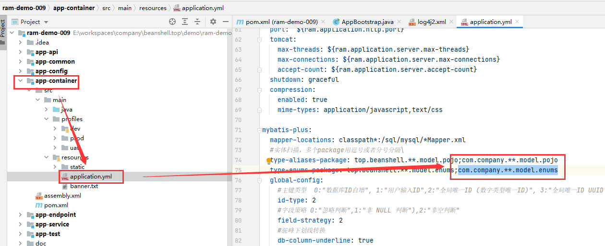

# ram-webapp-with-mybatis
ram 项目工程原型-mybatis版本

## 使用方法


### 命令行创建

命令行创建(需先安装并配置好maven)：

打开cmd(windows)/terminal(*unix)，切换到代码存放目录，执行如下命令，即可初始化项目：

注意：该命令会在当前目录自动创建一个和DartifactId名称一样的文件夹。

```bash

mvn archetype:generate -DgroupId=com.company -DartifactId=your-artifact-id -Dversion=1.0.0-SNAPSHOT -Dpackage=top.beanshell -DarchetypeGroupId=top.beanshell -DarchetypeArtifactId=ram-webapp-with-mybatis-archetype -DarchetypeVersion=1.0.0
```

将以上代码中的DgroupId、DartifactId的值替换为你想要的值(DgroupId如果使用top.beanshell，后续需要配置的工作将会少很多)。

### Intellij Idea 创建

首次创建，需要先添加工程原型信息，之后才可以直接使用原型新建项目

#### 添加项目原型

New Project-->Maven-->Create from archetype--> Add Archetype


准确填写3坐标信息：

| 项目 | 值 |
|  ----  | ----  |
| GroupId | top.beanshell |
| Artifact | ram-webapp-with-mybatis-archetype |
| Version | [点击查询最新版本](https://search.maven.org/search?q=g:top.beanshell%20AND%20a:ram-webapp-mybatis-archetype) |


点击OK，即可完成原型项目的添加。


#### 使用原型创建项目

在原型列表中，选择上一步添加的原型，点击Next：


按提示填写项目名称、保存路径、三坐标信息：

注意： GroupId 使用 top.beanshell 后续将会减少很多配置工作，如果命名为其他包名，则需添加/修改一些配置，才能让程序正常跑起来。


点击 Finish 完成项目创建：


看到下图所示，表明项目已经初始化好了：


#### 初始化数据库

打开 doc/sql 文件夹，使用初始化脚本，初始化数据库（需要先创建好数据库，再执行初始化脚本）：


#### 修改系统配置信息

接着 打开 app-container/src/main/profiles/dev/application-dev.properties,按图所示，修改数据库、Redis连接信息：

注意： 原型工程默认开放 8089 HTTP端口，如有端口冲突，请也一并将application-dev.properties配置文件中的ram.application.http.port值修改为系统空闲的端口（建议端口取10000~60000中的一个）。


如果你是以top.beanshell作为groupId，那么到这里，就可用直接跑单元测试了；如果不是top.beanshell作为groupId，那么请继续以下的修改。

#### groupId不是top.beanshell

如果你创建项目的时候，groupId不是top.beanshell，那么需要对项目工程做一定的修改，包括：
1. 组件包扫描需添加top.beanshell到启动器, @ComponentScan("top.beanshell")
   
2. 日志输出配置（开发、测试环境），需要添加top.beanshell包输出debug级别日志，以供方便调试，查询部分SQL输出 (可选)
   
3. mybatis plus 的mapper扫描配置需添加top.beanshell.**.mapper
   
   
4. mybatis plus的pojo数据库实体映射类扫描配置需添加 com.company.**.model.pojo（以com.company作为你的groupId为例）
5. mybatis plus的枚举包路径扫描配置需添加 com.company.**.model.enums（以com.company作为你的groupId为例）
   
   
6. 修正app-test下的单元测试类，部分ram基础组件的包名被maven自动替换了，只需将 com.company 替换为 top.beanshell 即可修正错误。（以com.company作为你的groupId为例）
   
   

#### 单元测试

以上的工作都完成后，mvn test 命令运行单元测试 测试配置的正确性了。

或者使用idea maven 面板，选中 root 模块 --> Lifecycle --> test 运行单元测试。


如果都能正常跑过单元测试，表明项目已经初始化好，可以开始业务代码的编写了：


单元测试都通过后，就可以使用 app-container/src/main/java/top/beanshell/AppBootstrap.java 的main方法，运行程序了：


### 整合前端

此后台工程可适配不同版本的前端，具体整合教程，前端原型工程有介绍。

前端犹如衣服，想穿哪一件就穿哪一件：

| 前端类型 | 项目地址 |
|  ----  | ----  |
| Ant-vue | [https://github.com/mbc3320/ram-webapp-console-antv.git](https://github.com/mbc3320/ram-webapp-console-antv.git) |
| Element-UI | 待开发 |
| Ant | 待开发 |


### 项目结构简介及代码存放规范


具体项目实践，请参考示例工程：

[https://github.com/mbc3320/ram-webapp-demo-mybatis.git](https://github.com/mbc3320/ram-webapp-demo-mybatis.git)


### 打包


uat环境打包（不执行单元测试）：

```bash
mvn clean package -Dmaven.test.skip=true -P uat
```

生产环境打包（不执行单元测试）：

```bash
mvn clean package -Dmaven.test.skip=true -P prod 
```


打包命令执行成功之后，会在项目根目录生成一个target文件夹：


target 文件夹下，包含两个子文件夹 jar、tar。

首次部署，需使用tar包部署，后续更新可使用jar包替换服务器jar更新。

### 部署

请参考官网教程： [https://beanshell.top](https://beanshell.top)

### 更新迭代

请参考官网教程： [https://beanshell.top](https://beanshell.top)